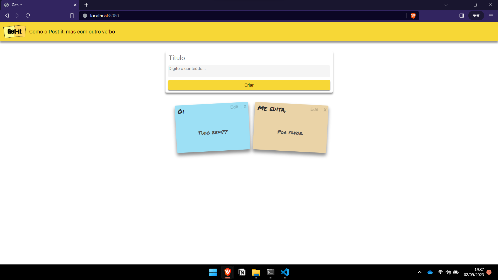

# Post-It App - Lucas Lima

## Descrição do Projeto

Este é um projeto desenvolvido por Lucas Lima como parte da disciplina de Tecnologias Web do quarto semestre do curso de Engenharia de Computação no Insper em São Paulo (SP). A aplicação é um campo de post-it digital que permite aos usuários adicionar, remover e editar post-its usando requisições HTTP. O servidor é executado localmente e os dados são armazenados em um banco de dados criado pela aplicação.



## Funcionalidades

A aplicação possui as seguintes funcionalidades:

1. Adicionar Post-Its: Os usuários podem adicionar novos post-its à página web fornecendo um título e um conteúdo para cada post-it.

2. Remover Post-Its: Os post-its existentes podem ser removidos individualmente.

3. Editar Post-Its: Os usuários podem editar o título e o conteúdo de um post-it já existente.

## Requisitos e Execução

Para executar a aplicação, siga os seguintes passos:

1. Certifique-se de que você possui o Python instalado em seu computador.

2. Clone o repositório da aplicação:

   ```bash
   git clone https://github.com/lucasouzamil/projeto1A-tecweb.git

3. Navegue para o diretório do projeto:

   ```bash
   cd projeto1A-tecweb

4. Execute o arquivo servidor.py para iniciar o servidor:

   ```bash
   python servidor.py

5. Abra qualquer navegador web e acesse o seguinte URL utilizando uma guia anônima:

   ```bash
   http://localhost:8080/

## Tecnologias Utilizadas
* Python: A aplicação é desenvolvida em Python.
* Banco de Dados (SQL): A aplicação utilzia SQL para criar e manipular os conteúdos dos post-it's.
* HTTP: As operações de adição, remoção e edição de post-its são realizadas por meio de requisições HTTP.

## Autor
* Nome: Lucas Lima
* Email: lucasfsl@al.insper.edu.br

## Licença
Este projeto está sob a Licença MIT. Você é livre para modificar e distribuir o código de acordo com os termos desta licença.